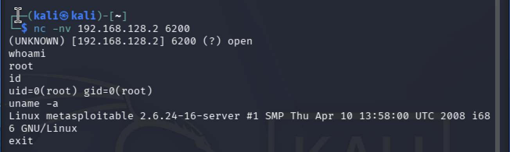

# Exploitation — vsFTPd 2.3.4

## Objective

Validate the vsFTPd 2.3.4 backdoor vulnerability in the isolated Metasploitable 2 lab environment.

## Target

| Item | Details |
|---|---|
| Target | Metasploitable 2 |
| IP Address | `192.168.128.2` |
| Service | FTP |
| Port | `21/tcp` |
| Version | vsFTPd 2.3.4 |
| Vulnerability | CVE-2011-2523 |

## Vulnerability Identification

The FTP service was identified during service enumeration:

```text
21/tcp open ftp vsftpd 2.3.4
```

Searchsploit was then used to identify publicly documented exploits for the detected version.

## Exploitation

The vulnerability was manually validated using Netcat within the isolated lab network.

The FTP backdoor was triggered through the FTP service, which caused a command shell to become available on TCP port `6200`.

The shell was then accessed from the Kali Linux attacker machine.

## Evidence

The following commands were executed after obtaining the shell:

```bash
whoami
id
uname -a
```

Results:

```text
whoami
root

id
uid=0(root) gid=0(root)

uname -a
Linux metasploitable 2.6.24-16-server #1 SMP Thu Apr 10 13:58:00 UTC 2008 i686 GNU/Linux
```



## Impact

Successful exploitation provides remote command execution with root privileges.

An attacker could potentially gain complete control over the vulnerable system.

## Mitigation

- Upgrade or remove the vulnerable vsFTPd version.
- Do not expose vulnerable FTP services to untrusted networks.
- Restrict access to FTP services using network controls.
- Monitor unexpected network connections and unauthorized services.

## Lab Scope

This exploitation was performed only against the intentionally vulnerable Metasploitable 2 virtual machine inside an isolated UTM lab environment.
